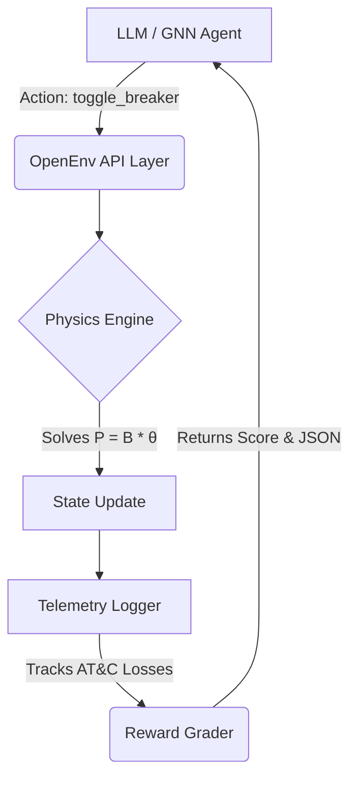
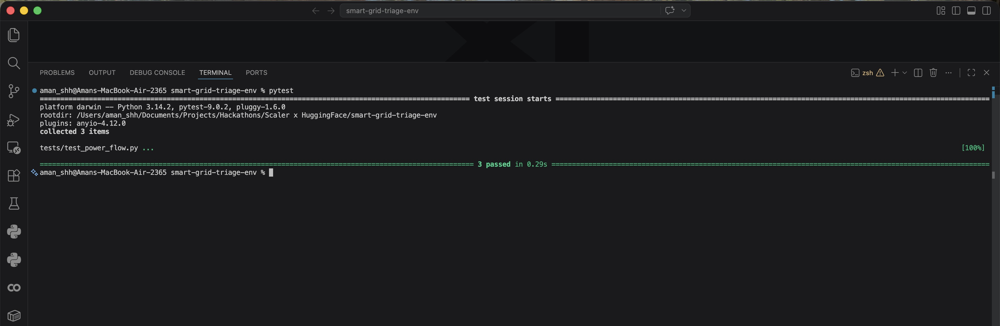

# Smart Grid Triage: Autonomous Fault Isolation and Load-Shedding Environment

🚀 **Live API / Interactive Demo:** [Hugging Face Space](#)

📖 **API Documentation (Swagger UI):** [Test the Endpoints Here](#)

---

Smart Grid Triage is a high-fidelity power distribution simulator built on the OpenEnv framework. It is designed to evaluate Reinforcement Learning (RL) agents and Large Language Models (LLMs) on their ability to manage complex distribution networks during catastrophic failures, focusing on maintaining critical infrastructure (hospitals, substations) while minimizing Aggregate Technical and Commercial (AT&C) losses.

---

## 🏗️ OpenEnv Multi-Mode Deployment

This environment is officially OpenEnv-ready, supporting standardized deployment for automated grading:

- **Package Manager:** Uses `uv` for deterministic builds via `uv.lock`.
- **Structure:** Follows the `server/` package convention.
- **Entry Point:** Registered server script in `pyproject.toml`.
- **Core Dependency:** Integrated with `openenv-core>=0.2.0`.

---

## Core System Architecture

The environment is structured into four decoupled layers to ensure physical accuracy and agent-agnostic evaluation:

1. **Physical Layer (NetworkX):** Represents the grid as a directed multigraph where nodes are buses (substations, residential, industrial, critical) and edges are transmission lines with specific reactance and thermal limits.
2. **Simulator Layer (NumPy/Linear Algebra):** Implements a DC Power Flow solver. It computes the voltage angles and real power flow across every branch using the bus admittance matrix ($B$).
3. **Observation Layer (Pydantic):** Strictly enforces the OpenEnv JSON schema. It translates raw graph states into validated, type-safe telemetry for the agent.
4. **Grading Layer (Dense Reward):** A hierarchical scoring engine that prioritizes load preservation based on node weights (e.g., Hospital=10, Residential=1) and penalizes excessive breaker cycling.

---

## Mathematical Foundation: DC Power Flow

Unlike simplified "flow" models, this environment utilizes the DC approximation of the power flow equations to ensure realistic current distribution. The system solves for the nodal voltage angles ($\theta$) using:

$$P = B \cdot \theta$$

Where:

- $P$: Vector of real power injections at each bus.
- $B$: The bus susceptance matrix derived from line reactances.
- $\theta$: Nodal voltage angles (reference bus set to $0$).

Post-solver, the line current is calculated to check for **Thermal Overload Alarms**, triggering stochastic cascade failures if limits are exceeded for multiple timesteps.

---

## Evaluation Scenarios

The repository includes three deterministic benchmarks designed to test specific grid-operator competencies:

| Task ID | Complexity | Objective            | Critical Constraint                                                                 |
|---------|------------|----------------------|-------------------------------------------------------------------------------------|
| Easy    | Low        | Load Balancing       | Reroute power via tie-breaker E7 to prevent a 92% thermal spike on E1.             |
| Medium  | Moderate   | Fault Isolation      | Isolate a short-circuit on N3 while maintaining N1/N2 uptime.                      |
| Hard    | High       | Critical Rerouting   | Shed residential load (N4) to preserve the Hospital (N1) during a primary substation failure. |

---

## Telemetry and Real-World Utility

To bridge the gap between AI research and DISCOM operations, the environment tracks real-world business metrics via a dedicated `GridTelemetry` module:

- **AT&C Loss Approximation:** Calculates the percentage of technical loss based on generation vs. successful consumption.
- **Hardware Wear Tracking:** Monitors breaker cycle counts, as frequent switching reduces equipment lifespan in physical substations.
- **Critical Uptime:** Measures the exact duration of power delivery to high-priority nodes.

---

## System Validation

### i. The Simulation Loop Architecture

The environment utilizes a strict, unidirectional data flow to prevent data leakage between the agent and the physics engine.



### ii. Physics Engine Verification

The DC Power Flow solver is verified against Kirchhoff's Circuit Laws using a suite of automated PyTest unit tests to ensure mathematical integrity before agent interaction.



### iii. Real-time Telemetry Tracking

During execution, the environment tracks operational metrics essential for DISCOM management, including technical losses and hardware stress.


### iv. Containerization Success

The environment is fully containerized with a non-root security context, ready for instant inference deployment.


---

## Installation and Execution

### Prerequisites

- Python 3.10+
- `uv` package manager (recommended) or `pip`
- Docker (Optional for containerized deployment)

### Local Setup

```bash
git clone https://github.com/YukiCodepth/smart-grid-triage-env.git
cd smart-grid-triage-env
pip install -r requirements.txt  # if not working use: pip3

# Using uv (Recommended)
uv sync
uv run uvicorn server.app:app --reload

# Using pip
pip install -e .
uvicorn server.app:app --reload
```

### Physics Verification

Before running agents, verify the mathematical conservation of energy within the solver:

```bash
pytest tests/
```

### Running the Baseline

The baseline utilizes an API-compatible client to interface with the environment.

```bash
export API_BASE_URL="https://api.openai.com/v1"
export MODEL_NAME="gpt-4-turbo"
export HF_TOKEN="your_token_here"
python inference.py
```

### Environment Stress Testing

For evaluation purposes, the repository includes a standalone stress-testing script to validate the throughput and stability of the OpenEnv API and the underlying physics engine under rapid concurrent stepping.

```bash
python stress_test.py
```

---

## Repository Structure

```text
├── server/
│   ├── __init__.py      # Package Marker
│   ├── app.py           # FastAPI Server (Entry Point)
├── env/
│   ├── grid_env.py      # OpenEnv Implementation
│   ├── power_flow.py    # DC Power Flow Solver
│   ├── models.py        # Pydantic State/Action Models
│   ├── telemetry.py     # AT&C and Wear Tracking
│   └── gnn_agent.py     # Graph Neural Network baseline
├── scenarios/           # YAML Task Specifications
├── stress_test.py       # API Throughput Evaluator
├── tests/               # PyTest Suite
├── assets/              # System validation images
├── Dockerfile           # HF Spaces Deployment Config
├── pyproject.toml       # OpenEnv Project Metadata
├── uv.lock              # Deterministic Lockfile
├── requirements.txt     # Legacy Dependency List
└── openenv.yaml         # Environment Manifest
```

---

## Research Applications

This environment is built to support beyond-LLM research, including Graph Neural Networks (GNN). The provided `GridGNN` baseline demonstrates how nodal features (voltage, injection, priority) can be processed through Graph Convolutional layers to learn topology-aware switching policies.
